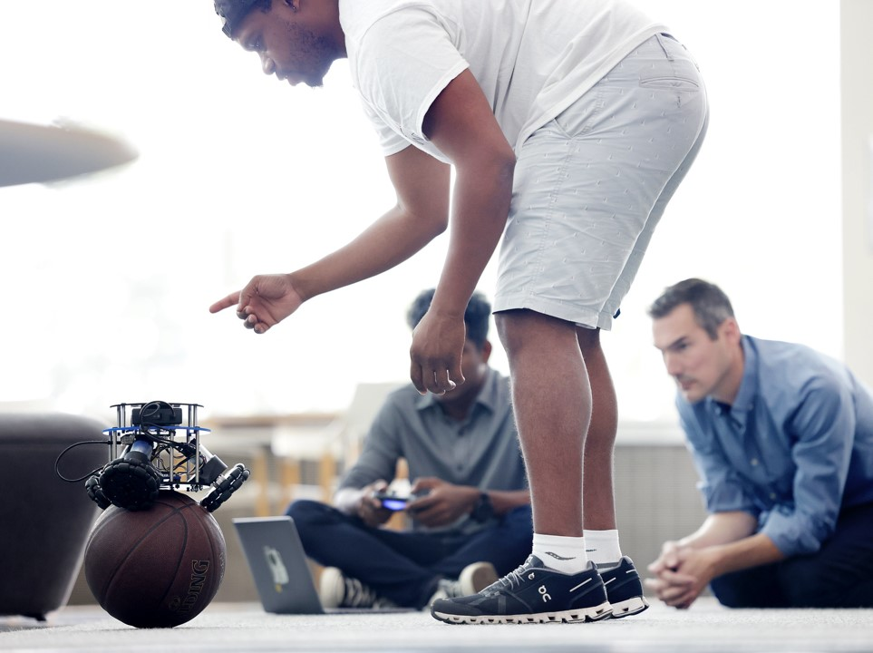

# Robotics 311: How to Build Robots and Make Them Move

ROB 311 is an undergraduate robotics course at the University of Michigan that introduces the fundamentals of mechanical design, control, fabrication, actuation, instrumentation, and computer interfaces required to realize robotic systems. Students will learn to analyze/simulate rigid body kinematics, kinetics, and dynamics, as well as assess the impedance properties of their designs.

This first iteration was offered in Fall 2022. The course is based around building a ballbot, which balances on a basketball to move around.

## Lectures
All lecture videos are available on YouTube: [ROB 311 Fall 2022 Playlist](https://www.youtube.com/watch?v=aZ-mrETfKmE&list=PLdPQZLMHRjDIWDJDjiBKjFe7ETD_rssB9)

If a lecture features additional files, those are located in [lecture files](https://github.com/michiganrobotics/rob311/tree/main/Lecture%20Files).

## Labs and hardware

[Labs](https://github.com/michiganrobotics/rob311/tree/main/Labs) are based around the design and build of the ballbot, requiring certain hardware and access to machines, including 3D printer, laser cutter, and water jet.

The parts list:
- Raspberry Pi Pico
- BlinkM led
- 3 Pololu 37D gearmotors
- 3 motor couplers
- acrylic sheets
- velcro strips
- 6 omni wheel halves
- 2 wired mouse
- basketball

Note lab 1, a primer on soldering, is not included in this repository, and lab 5 is skipped.

## Course Plan
| Lecture | Topic                               | YouTube                                     | Assignments Due                  |
|---------|-------------------------------------|---------------------------------------------|----------------------------------|
|       1 | Introduction to robot development   | [Video](https://www.youtube.com/watch?v=aZ-mrETfKmE) |                                  |
| L1      | Lab: Soldering                      |                                             |                                  |
|       2 | Motors, transmissions, & drivers I  | [Video](https://www.youtube.com/watch?v=Mq1Bgk68PBI) |                                  |
|       3 | Motors, transmissions, & drivers II | [Video](https://www.youtube.com/watch?v=Oz2Eo8m5Dek) |                                  |
| L2      | Lab: Raspberry Pi's                 |                                             |                                  |
|       4 | Mechanical modeling                 | [Video](https://www.youtube.com/watch?v=HCKUdEtMk7Y) |                                  |
|       5 | Modeling & design                   | [Video](https://www.youtube.com/watch?v=dP0wdarfrkY) | HW 1                             |
| L3      | Lab: Solidworks                     |                                             |                                  |
|       6 | Thermal modeling                    | [Video](https://www.youtube.com/watch?v=CyqpaNBj9x0) |                                  |
|       7 | Manufacturing                       | [Video](https://www.youtube.com/watch?v=a9g4DT3PtMI) |                                  |
| L4      | Lab: Lasercutting                   |                                             |                                  |
|       8 | Additive manufacturing              | [Video](https://www.youtube.com/watch?v=YzE1I1oQzHI) |                                  |
|       9 | Subtractive manufacturing           | [Video](https://www.youtube.com/watch?v=Pls2lRZjnxo) |                                  |
| L6      | Lab: Ballbot assembly               |                                             | Ballbot assembled                |
|      10 | Manufacturing best practices        | [Video](https://www.youtube.com/watch?v=BBs-HmwfgLc) |                                  |
|      11 | Gears, screws & linkages            | [Video](https://www.youtube.com/watch?v=xYcbeahHpbk) |                                  |
| L7      | Lab: Python                         |                                             |                                  |
|      12 | Full planar model                   | [Video](https://www.youtube.com/watch?v=MVAvgaW5twc) | HW 2                             |
|      13 | Torque conversion                   | [Video](https://www.youtube.com/watch?v=8ChdTWNvGpY) |                                  |
| L8      | Lab: Closed loop control            |                                             |                                  |
|      14 | Kinematic conversions               | [Video](https://www.youtube.com/watch?v=uLpom1g87a0) |                                  |
| L9      | Lab: Kinematics                     |                                             |                                  |
|      15 | Sensors                             | [Video](https://www.youtube.com/watch?v=9VtycgTxyyI) | HW 3                             |
|      16 | Digital communications              | [Video](https://www.youtube.com/watch?v=Y-86CC3WgMU) |                                  |
| L10     | Lab: Stability control              |                                             |                                  |
|      17 | Omni wheels                         | [Video](https://www.youtube.com/watch?v=Ykprm8sEqzw) |                                  |
|      18 | Ballbot work session                | No lecture                                  |                                  |
| L11     | Lab: Outer velocity loop control    |                                             |                                  |
|      19 | Review                              | [Video](https://www.youtube.com/watch?v=hH9S14uijNM) | Midterm (not publicly available) |
| L12     | Lab: Virtual environments           |                                             |                                  |
|      20 | Control                             | [Video](https://www.youtube.com/watch?v=tzFXzcDsMec) | HW 4                             |
|      21 | Control loop structure              | [Video](https://www.youtube.com/watch?v=KcQr0awXiuQ) |                                  |
| L13     | Lab: Filtering data                 |                                             |                                  |
|      22 | Ballbot work session                | No lecture                                  |                                  |
|      23 | Filtering data                      | [Video](https://www.youtube.com/watch?v=sBFdfnljp9M) |                                  |
| L14     | Lab: Ballbot work session           |                                             | HW 5                             |
|      24 | Steering control                    | [Video](https://www.youtube.com/watch?v=FliyuyiXhro) |                                  |
|      25 | Final competition                   |                                             |                                  |

## Credits
- Elliott Rouse, Associate Professor, U-M
- Yves Nazon
- Senthur Ayyappan

## For more
- [University of Michigan Robotics](https://robotics.umich.edu)
- [Michigan Robotics Twitter](http://twitter.com/umrobotics)
- [Michigan Robotics Instagram](http://instagram.com/umrobotics/)
- [Michigan Robotics LinkedIn](https://www.linkedin.com/company/university-of-michigan-robotics/)
